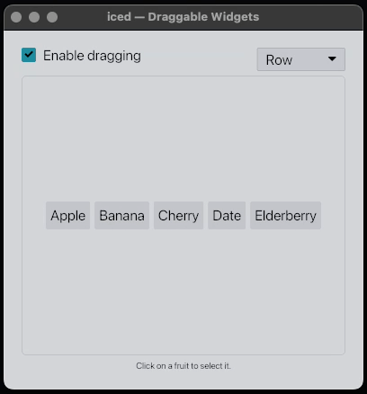

<div align="center">

# dragking

[](https://github.com/iced-rs/iced)

A very simple implementation of drag and drop for `iced`'s `Row` and `Column` widgets.

*Details may vary. Void where prohibited. Batteries not included. Side effects
may include code reviews, merge conflicts, and the occasional None where Some
was expected.*



</div>

## Usage

Check out the `examples` directory for a simple example or run it via:

```
$ cargo run --example simple
```

## License

MIT
